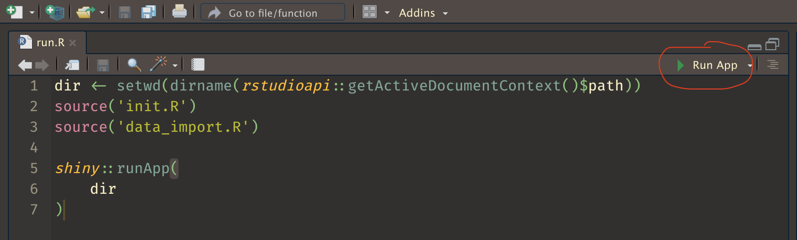

# Contents
- [Purpose](#purpose)
- [Requirements](#requirements)
- [File Orgainzation](#file-organization)
- [How to start](#how-to-start)
    - [RStudio](#rstudio)
    - [Terminal](#terminal)
- [Usage](#usage)
    - [Initial view](#usage)
    - [Interactivity](#interactivity)
    - [Example](#example)
- [Info](#info)
    - [Data Sources](#data-sources)
    - [Contributing](#contributing)
- [TODO](#todo)

---

# Purpose
The purpose of this project is to use the R Shiny framework to build a COVID tracking and analysis tool that can compare Minnesota counties with other Minnesota counties and to the state as a whole across several measures. This is nothing ground breaking.

---

# Requirements
:warning: This was developed for ease of use on macOS. Not all elements of this project are guaranteed to work on windows or linux machines. At least not yet. :warning:

#### Required
- [R](https://cran.rstudio.com/)

#### Not required but helpful
- [RStudio](https://www.rstudio.com/products/rstudio/download/#download) (makes it easier to run the app and edit code base)

---

# File Organization
The contents of the Shiny App are segmented into 5 .R files.

1. run.R - runs the Shiny App
1. init.R - loads all required R packages
1. ui.R - standard shiny ui.R file
1. server.R - standard shiny server.R file
1. data_import.R - imports and wrangles data

---

# How to start
## RStudio
RStudio is the easiest way to run this app. Simply set the working directory to the COVID-19-Minnesota-Counties directory then open run.R and click "Run App" button.

```r
setwd(~/COVID-19-Minnesota-Counties) #change to your location
```


or just source the `run.R` file in the R Console. 

```r
setwd(~/COVID-19-Minnesota-Counties) #change to your location
source(run.R)
```

viola, you now have access to the app directly in RStudio (or in any web browser)!

## Terminal
An alternate way to run this app is with the `app.sh` bash script. This checks for R, then runs the app.

Launch a terminal session and execute these commands. 
Here's an example starting with `git clone`
```
git clone https://github.com/rennerom/COVID-19-Minnesota-Counties.git
cd COVID-19-Minnesota-Counties
sh app.sh
```
This will launch the Shiny App in your default web browser. 

---

# Usage
When you first launch the app you will see an interactive menu on the left and a graph on the right. If you don't see either of these, try building/running the app again.

The graph shows COVID-19 cases per capita over time. By default, state level data, represented as a thick grey line, is toggled on. There are also several "noisy" or "chaotic" looking thin grey lines above and below the state level thick grey line. Each thin line is a single Minnesota county. Once counties are selected in the menu they will be highlighted so that they are easier to view.


### Interactivity
#### County
Either start by typing in a county, or scrolling through the list of MN counties and select one or more. Each county will be highlighted on the graph

#### Date Filter
Sets the date limits of the graph. The dates will be as up to date as when you last launched the app or if the New York Times update their source data, which they do each day.

#### Zoom y-axis in/out
The y-axis limits are determined by the maximum county level cases per capita for ALL counties whether you've selected them in your filter or not. If you want to get your selection to fit the graph a little cleaner, you can zoom the slider as you see fit. 

#### State level data
The default of this toggle is to highlight the state level measures. This allows for comparisons for each county to the state as a whole. You can turn it off if you don't need or want it.
<br>
#### *Example*
|  |
|:-- |
| *Here's an example where the plot is filtered to Hennepin, Ramsey, and Anoka Counties, date range is from Jan 1, 2021 to Jul 31, 2021, y-axis is zoomed to a more ideal range, and the state level data toggle was left on.* |

---

# Info
#### Data Sources
- This data is sourced from the New York Times [covid-19-data](https://github.com/nytimes/covid-19-data) github repo

#### Contributing
- Have suggestions? Feel free to contribute by submitting pull requests or collaborate over email.  
- Contact: rennerom@gmail.com

---

# TODO
Will do

- [x] Infection rates
- [ ] Death rates
- [ ] hospitalization rates
- [ ] Vaccination rates
- [ ] Rolling 4 week percent changes in infections/deaths/hospitalization/vaccination rates

Want to do

- [ ] Add/convert additions above using shiny modules
- [ ] County geomap selector
- [ ] Sortable/filterable data table

Will try to do, time permitting

- [ ] Optomize data processing (lots to do here)
- [ ] Windows compatible
- [ ] Heroku deployment

